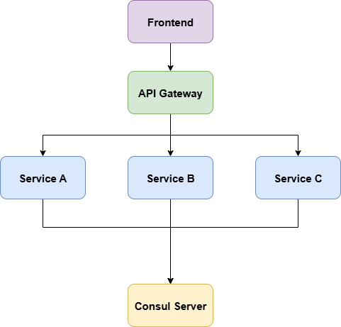
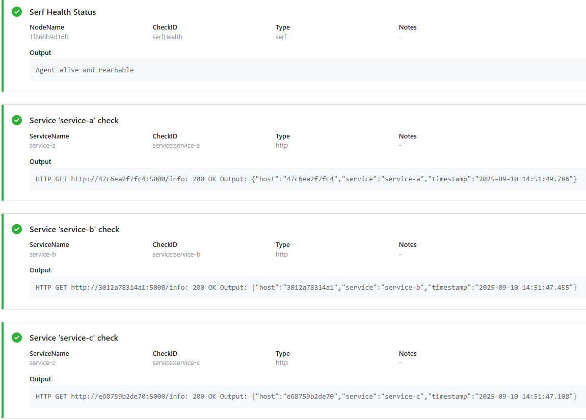
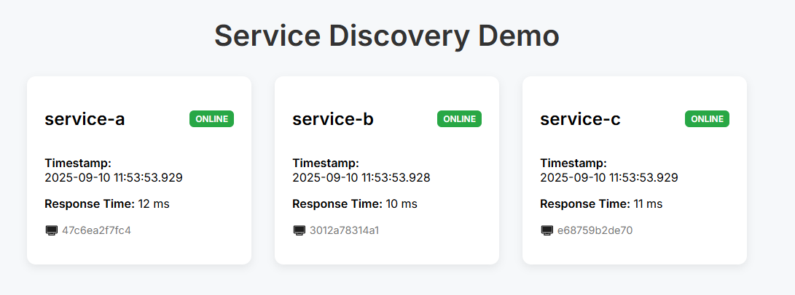
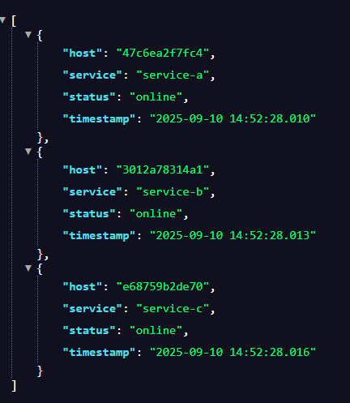

# Service Discovery Demo Project
A service discovery Project with dummy services registering with Consul and an api that connects consul discovery to a frontend dashboard service, can be deployed using Docker compose or Kubernetes
## [Project Page](https://roadmap.sh/projects/service-discovery)

## Project Overview
```
service-discovery/
├── docker-compose.yml
├── gateway/              # API Gateway (Python + Flask)
├── service/              # Dummy service template
├── frontend/             # React app (Vite + Nginx)
```
### Prerequisites:
- Docker & Docker Compose
- Kubernetes
- Run Pre commit deps:
```
python -m pip install --upgrade pip
python -m pip install pre-commit
python -m pre_commit install

# for baseline run once
python -m pre_commit run --all-files
```
### Run the project with Compose
```
docker-compose up --build

| Component        | URL                                                              |
| ---------------- | ---------------------------------------------------------------- |
| Frontend UI      | [http://localhost:3000](http://localhost:3000)                   |
| API Gateway      | [http://localhost:8000/services](http://localhost:8000/services) |
| Consul Dashboard | [http://localhost:8500](http://localhost:8500)                   |
```
## [Run the project with Kubernetes](./k8s/README.md)

### Features
- Dummy services auto-register with Consul, up to 9 services
- API Gateway discovers and proxies routes dynamically
- Frontend shows:
    - Service name and hostname
    - Live timestamp with milliseconds
    - Online/offline status badge
    - Response time
- Fully containerized with Docker
### Testing the System
```
# Wait until all services are up watch the logs
Registered with Consul: 200
 * Running on http://0.0.0.0:5000
 * no errors GET returning 200

# Check Consul UI if all services are listed and healthy
http://localhost:8500

# Test API Gateway curl or use browser and get 3 json service objects
http://localhost:8000/services

# Frontend check for title and 3 service cards showing online and feeding data
http://localhost:3000

# Service Failure Simulation
docker ps  # get service name
docker stop <service>
# Wait a few seconds
# Check Frontend responding

docker start <service>
# Wait a few seconds
# Check Frontend responding

docker-compose down
```
## Screenshots:



